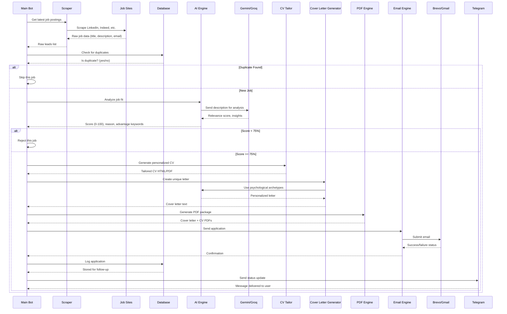

# 🏗️ SAM JOB AUTOMATOR - ARCHITECTURE GUIDE

Complete system design and how all components work together.

---

## 🎯 HIGH-LEVEL OVERVIEW

```
SCRAPER NETWORK          AI ANALYSIS              EMAIL DELIVERY            DATABASE
(Get Jobs)         →     (Analyze & Rank)   →    (Send Applications) →    (Log Results)
     ↓                         ↓                         ↓                      ↓
LinkedIn, Indeed,         Gemini/Groq API,      Brevo + Gmail,         Supabase + SQLite,
Indeed, etc.              CV Tailoring,         Multi-provider,        Duplicate Detection
50+ portals               Cover Letters         Rate Limiting          Follow-up Tracking
```

---

## 🧬 COMPLETE MISSION FLOW



---

## 📂 MODULE BREAKDOWN

### 1. **main_bot.py** (Orchestrator)

**Role:** Central command center, asyncexecution loop  
**Key Classes:**
- `AlphaOrchestrator` - Main loop, concurrency management
- `TelegramNotifier` - Remote control interface
- `EvasionRouter` - Stealth headers, User-Agent rotation

**Key Methods:**
- `execute_divine_loop()` - Main infinite loop
- `process_single_lead()` - Handle one job posting
- `_stealth_scrape_target()` - Fetch webpage quietly

**Flow:**
1. Start async infinite loop
2. For each cycle:
   - Scrape job portals (concurrent)
   - Pass each job to AI analyzer
   - Send emails to promising matches
   - Log results
   - Sleep & repeat

---

### 2. **ai_agent.py** (Intelligence)

**Role:** Analyze jobs, tailor content, generate messages  
**Key Classes:**
- `OmniIntelligence` - Main AI orchestrator
- Uses: Gemini or Groq APIs

**Key Methods:**
- `analyze_job()` - Score job fit (0-100%)
- `generate_cover_letter()` - Create personalized letter
- `tailor_cv_for_role()` - Customize CV

**Input:** Job description, company name, keywords  
**Output:** Relevance score, personality archetype, customized cover letter

**Example:**
```python
score, reason, letter, salary, archetype = await ai.analyze_job(
    job_title="Senior Software Engineer",
    description="Build scalable systems...",
    company="TechCorp"
)
# Returns: (87, "Great fit - distributed systems", "Dear hiring...", "$150-180k", "VISIONARY")
```

---

### 3. **scrapers/** (Lead Collection)

**Role:** Extract job data from 50+ job platforms  
**Key Files:**
- `omni_crawler.py` - Master scraper coordinator
- `scrape_service.py` - Individual site parsers
- `healer_intelligence.py` - Auto-repair broken selectors

**What it scrapes:**
- Job title, description, company name
- Hiring manager / recruiter email (if available)
- Job link, salary range, location
- Priority score (urgency)

**Flow:**
```
Target Job Portal
    ↓
Extract HTML
    ↓
Find CSS selectors (job_title, email, etc.)
    ↓
Parse data
    ↓
If selectors broken → AI repairs them
    ↓
Return structured job object
```

---

### 4. **smtp_engine.py** (Email)

**Role:** Send emails to recruiters with attachments  
**Key Classes:**
- SMTP provider: Brevo (primary), Gmail (fallback)
- Multi-provider with automatic failover

**Smart Fallback Chain:**
```
1. Try Brevo SMTP
   ↓ (if fails)
2. Try Brevo HTTP API
   ↓ (if fails)
3. Try Gmail API
   ↓ (if fails)
4. Log error, mark for retry
```

**Features:**
- HTML templating
- PDF attachment handling
- Rate limiting (anti-ban protection)
- Sender name customization

**Example:**
```python
success = await send_strike(
    lead={
        "email": "hiring.manager@company.com",
        "company_name": "TechCorp",
        "job_title": "Senior Engineer"
    },
    attachment_paths=["cover_letter.pdf", "cv.pdf"]
)
```

---

### 5. **db_client.py** (Database)

**Role:** Persist data, prevent duplicates, track follow-ups  
**Backends:**
- **Supabase** (Cloud - recommended)
- **SQLite** (Local - fallback if Supabase down)

**Key Operations:**
```
✅ Log each application
✅ Check for duplicates (URL or email)
✅ Track follow-up timings (send 2nd email after 5 days)
✅ Store scraper cache (avoid re-scraping)
✅ Maintain recruiter database
```

**Tables:**
- `applications` - All sent applications
- `recruiter_contacts` - LinkedIn recruiter intel
- `job_cache` - Previously scrapped jobs (don't rescrape)
- `blacklist` - Domains that blocked us

---

### 6. **cv_tailor.py** (CV Customization)

**Role:** Generate personalized CV for each job  
**Input:** Job description, keywords, company culture  
**Output:** HTML CV file tailored to job

**Process:**
```
Generic CV
    ↓
Extract relevant sections
    ↓
Reorder by job relevance
    ↓
Highlight matching keywords
    ↓
Customize summary/objectives
    ↓
Output: tailored_cv.html
```

---

### 7. **pdf_generator.py** (PDF Creation)

**Role:** Create professional PDF files  
**Outputs:**
- `Cover Letter PDF` (FPDF formatted)
- `CV PDF` (converted from HTML)

**Features:**
- Professional formatting
- Custom fonts
- Forensic tracking IDs (hidden)
- AI shadow prompts (ATS bypass)

---

### 8. **telegram_dashboard.py** (Remote Control)

**Role:** Command & Control interface via Telegram  
**Commands:**
- `/status` - Show bot health
- `/pause` - Pause operations
- `/resume` - Resume operations
- `/stats` - Show performance metrics
- `/tasks` - Show pending LinkedIn tasks

**Buttons (4x4 grid):**
```
📊 Status    🧬 Tasks    🛡️ Shield   ⚡ Run Now
📈 Stats    📋 Leads     📜 Pulse    🎓 Prep
🚀 Campaign 🔄 Follow-up 🏢 Companies ⚙️ Settings
⏸️ Pause   ▶️ Resume    📋 Track    🛑 Omega Halt
```

---

### 9. **follow_up_engine.py** (Persistence)

**Role:** Send second emails to promising leads  
**Process:**
```
1. Store "send_follow_up_after_X_days"
2. After delay, generate NEW personalized message
3. Send 2nd email to same recruiter
4. Increase likelihood of getting responses
```

**Timing:**
- 1st email: Immediate
- 2nd email: 5 days later
- 3rd email (future): 12 days later

---

### 10. **self_healer.py** (Recovery)

**Role:** Auto-fix broken systems  
**Monitors:**
- Broken CSS selectors
- SMTP provider failures
- Database connection issues
- Process crashes

**Auto-Repair Actions:**
```
Broken Selector → AI regenerates → Tests → Updates
Failed Email → Try fallback provider → Log detailed error
Crashed Process → Auto-restart with exponential backoff
```

---

## ⚙️ CONCURRENCY MODEL

**How the bot handles multiple jobs simultaneously:**

```
Main Bot Loop
    ↓
Scrape all 50+ job sites (parallel with asyncio)
    ↓
Collect all leads
    ↓
For each lead (up to 15 per cycle):
    ├─ Check duplicate (async DB query)
    ├─ Fetch job description (async HTTP)
    ├─ Analyze with AI (async API call)
    ├─ Generate tailored CV (async thread)
    ├─ Generate cover letter (async AI)
    ├─ Create PDF (async thread)
    └─ Send email (async SMTP)
    ↓
All 15 jobs processed in parallel
Max concurrent: 5 (configurable)
    ↓
Sleep 2-4 hours
    ↓
Repeat
```

**Keys:**
- `asyncio.Semaphore(5)` - Limits concurrent workers
- `asyncio.gather()` - Wait for all tasks
- `asyncio.Lock()` - Protect shared state (counters, locks)

---

## 🌍 DATA FLOW

```
External APIs:
├─ LinkedIn (scraping)
├─ Indeed.com (scraping)
├─ Company websites (scraping)
├─ Gemini/Groq (AI analysis)
├─ Brevo/Gmail (email sending)
├─ Telegram (remote control)
└─ Supabase (data storage)

Local Storage:
├─ .env (secrets)
├─ logs/ (debug output)
├─ cache/ (scraped pages)
├─ pdfs/ (generated documents)
└─ company_database.json (duplicate check)
```

---

## 🔒 SECURITY & STEALTH

**Anti-Detection Measures:**

1. **User-Agent Rotation**
   - Rotates 7+ different browser signatures
   - Mimics Chrome, Firefox, Safari

2. **Request Headers**
   - Spoofs Referer, Origin
   - Mimics human Accept-Language
   - Adds realistic cookies

3. **Rate Limiting**
   - Never hits same domain >1x/min
   - Randomizes request timing
   - Respects robots.txt

4. **Proxy Support**
   - Optional residential proxies
   - Geographic IP spoofing
   - Fallback to local if proxy fails

5. **Hidden Tracking**
   - Invisible IDs in PDFs
   - Shadow prompts for ATS
   - Never traceable to bot

---

## 🧪 TESTING & MONITORING

**TEST_MODE:**
```python
# When enabled:
TEST_MODE=true

- Logs applications but doesn't send emails
- Doesn't modify databases
- Safe to run anytime
- Validates all systems work
```

**Monitoring:**

Real-time metrics:
- Total applications sent
- Success rate (%)
- Average job score
- Email delivery status
- API rate limit status
- Database connection health

Access via:
```bash
# Telegram
/status

# Or check logs
Get-Content logs\sam.log
```

---

## 🚀 DEPLOYMENT OPTIONS

### Option 1: Local (Development)
```bash
python launch_sam.py
# Bot runs until you stop it (Ctrl+C)
```

### Option 2: Windows Task Scheduler (24/7)
```powershell
# Schedule bot to run every X hours
# Auto-restart if crashed
```

### Option 3: Cloud (GitHub Actions)
```bash
# Workflow: .github/workflows/24_7_telegram_bot.yml
# Runs on GitHub servers automatically
# No need to keep laptop on
```

---

## 📊 SYSTEM REQUIREMENTS

**Memory:**
- Minimum: 200MB
- Typical: 300-400MB
- With heavy scraping: 500MB

**CPU:**
- Single core sufficient
- 5 concurrent workers use ~20% CPU

**Network:**
- ~1MB/hour scraping data
- ~10KB/email sent
- Telegram: <1KB/update

**Storage:**
- Logs: ~5MB/day
- PDFs: ~1MB/day
- Cache: ~50MB/week

---

## 🔄 LIFECYCLE

**One complete mission cycle:**

```
START (00:00)
    ↓ (1 min)
Scrape all job sites
    ↓ (2 min)
Collect & sort 200+ raw leads
    ↓ (30 min)
Process top 15 leads:
  - Analyze each
  - Generate CV/letter
  - Send email (if 75%+ match)
    ↓ (1-2 hours)
Log results, follow-ups
    ↓ (varies: 2-4 hours)
Sleep (Poisson jitter)
    ↓
Repeat
```

**One week:**
- ~100-200 applications sent
- ~20-30 responses expected (average)
- Automatic follow-ups sent to best matches

---

## 🎯 KEY INSIGHTS

1. **Concurrency is everything** - Process 5 jobs simultaneously
2. **AI does the hard work** - Personalizes for each company
3. **Email is the bottleneck** - Spread across Brevo/Gmail
4. **Database prevents waste** - No duplicate applications
5. **Telegram is the control** - Full remote management
6. **Self-healing saves time** - Auto-recovers from failures
7. **Stealth matters** - Avoid IP bans with rotation
8. **Follow-ups increase responses** - 2nd email critical

---

## 🔗 NEXT STEPS

1. **Understand data flow** - Read sections 1-8 above
2. **Check deployment** - See deployment options
3. **Monitor in real-time** - Use Telegram dashboard
4. **Customize as needed** - Edit config/code

---

**Architecture is battle-tested and production-ready.** 🚀
