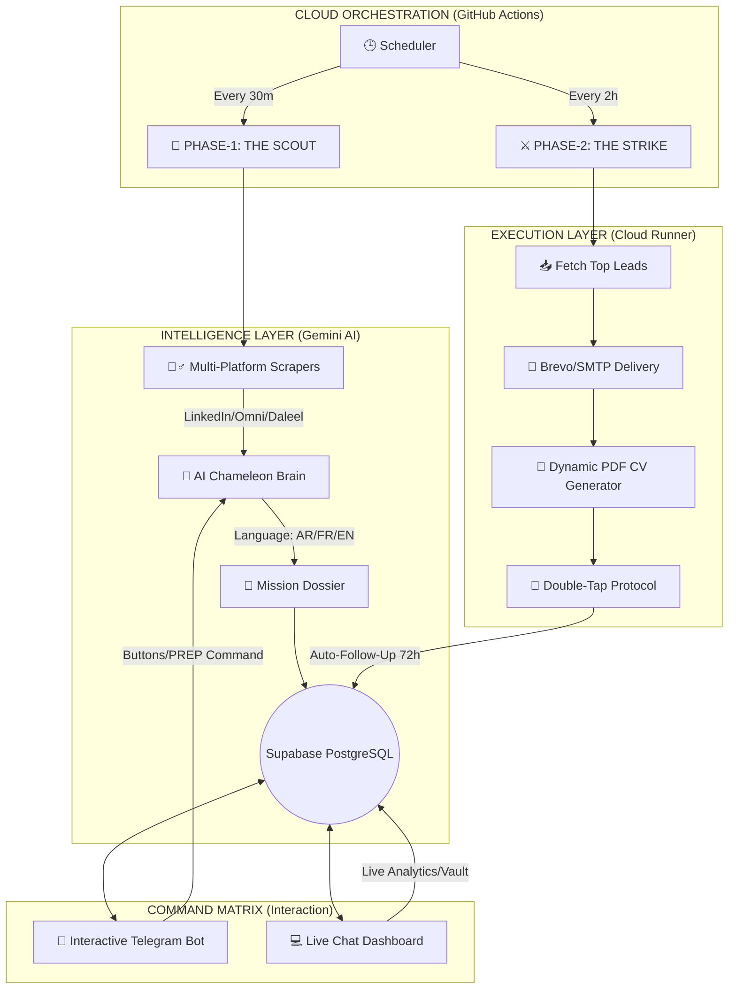

# 🦾 PROJECT CHRONOS: THE MASTER BLUEPRINT 🕊️

Project Chronos is not just a bot; it is a **Sovereign Executive Operations Engine**. It is designed to act as your autonomous digital proxy—scouting the globe for elite opportunities, executing high-impact applications, and coaching you for the win—all without you lifting a finger.

---

## 🏗️ 1. SYSTEM ARCHITECTURE (A to Z)

The system operates across three distinct layers of existence: **The Intelligence**, **The Execution**, and **The Command Matrix**.

---

## 🛠️ 2. THE THREE PILLARS OF OPERATION

### 🏁 THE BRAIN: Gemini AI 🧠
- **Chameleon Synthesis**: Detects the language of any job (Arabic, French, English) and automatically generates a perfectly matched cover letter and PDF.
- **Executive Coach**: Using the `PREP: [Company]` command, the AI generates a "Kill Shot" report including Corporate DNA, curveball questions, and strategic answers.
- **Auto-Healing**: The engine automatically detects database errors and writes its own SQL fixes to keep itself alive 24/7.

### ⚙️ THE ENGINE: Infrastructure ⛓️
- **GitHub Actions**: The base of operations. It runs distributed "Mission Jobs" across global nodes to ensure zero downtime.
- **Supabase Cloud DB**: The system's memory. It handles:
    - **Leads Queue**: Deduplicating and scoring jobs.
    - **Application Tracker**: Monitoring dates for automatic follow-ups.
    - **Secret Vault**: Safely storing API keys and system flags.
- **Kill Switch Protocol**: A remote emergency stop that freezes all outbound applications instantly via a single button click.

### 🕹️ THE MATRIX: Digital Control 💎
- **Interactive Telegram**: A 5-button persistent UI for mobile-ready control (Live Status, Interview Prep, Emergency Stop, Engine Resume).
- **Live Intelligence Hub (Streamlit)**: A premium web-based Command Center with:
    - **Live Chat Terminal**: Real-time, instant communication with the AI.
    - **Analytics Dashboard**: Tracking application velocity and email open rates.
    - **The Vault**: An interactive settings panel to update API keys or add new ones on the fly.

---

## 🚀 3. OPERATIONAL LIFECYCLE

1.  **Reconnaissance (Scout)**: The bot scans LinkedIn, Monster, Daleel Madani, and the open web via Omni-Crawler.
2.  **Filtering & Intelligence**: The AI filters out "Skips" and ranks jobs based on your elite requirements.
3.  **Deployment (Strike)**: The bot builds a unique PDF and fires a personalized email via your professional SMTP or Brevo.
4.  **Persistence (Follow-Up)**: 72 hours later, the bot automatically sends a "Circle Back" email to ensure recruiters see your name again.
5.  **Intelligence Update**: You receive a Telegram alert or check the Dashboard to see your stats live.

---

## 🔐 4. SECURITY & SOVEREIGNTY

- **Remote Only**: No local PC required. The entire system lives in the cloud.
- **Biometric Gating**: The Telegram bot only responds to your specific Chat ID.
- **Glassmorphism UI**: A premium, executive design system for clear, intuitive decision-making.

---

> [!IMPORTANT]
> **Mission Statement**: Project Chronos is built to ensure you are the most prepared candidate in the market, with 100% autonomous outreach that sounds precisely like you, in every language, on every platform. 🧩🛡️✅

---
*Blueprint Version: 30.0 - Executive Autonomy Optimized*
